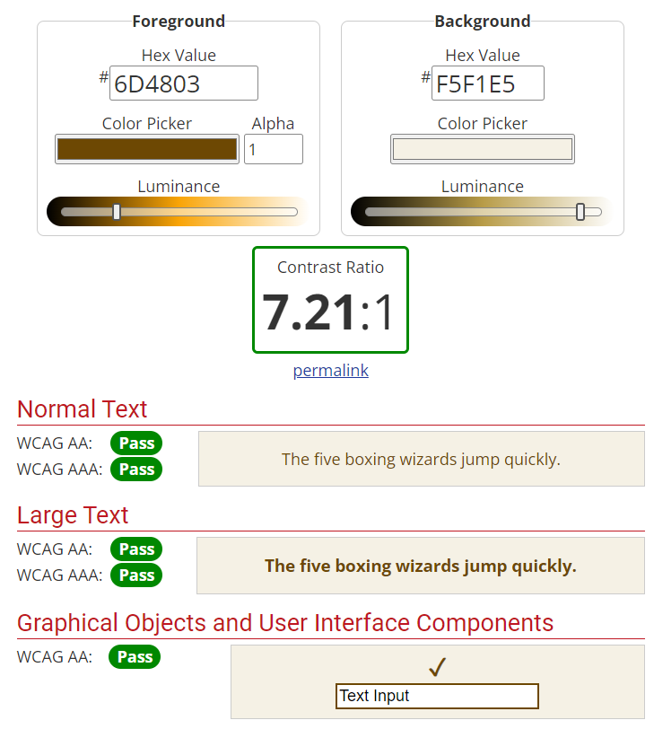

# TheHungryLlama

<h1>Color Scheme</h1>

The Color scheme was chosen with contrast in mind and the help of <a href="#webaim">WebAIM</a>

<ul>
    <li>
        <a href="https://www.color-hex.com/color/ffffff" target="_blank">Background Primary Color</a> 
        
    </li>
        <li>
        <a href="https://www.color-hex.com/color/f5f1e5" target="_blank">Background Secondary Color</a> 
        
    </li>
    <li>
        <a href="https://www.color-hex.com/color/000000" target="_blank">Primary Text Color</a> 
        
    </li>
    <li>
            <a href="https://www.color-hex.com/color/6d4803" target="_blank">Secondary Text Color</a> 
        
    </li>
</ul>
<h1>Deployment</h1>
<ul>
    <h2>Using Github Pages</h2>
    <li>
        Navigate to the GitHub <a href="https://github.com/LittleCanOpener/Skilaverkefni-1-2024-Second-Semester" target="_blank">Repository</a>:
    </li>
    <li>
        Click the 'Settings' Tab.
    </li>
    <li>
        Scroll Down to the Git Hub Pages Heading.
    </li>
    <li>
        Select 'Master Branch' as the source.
    </li>
    <li>
        Click the Save button.
    </li>
    <li>
        Click on the link to go to the live deployed page.
    </li>
</ul>
    <h2>Here Is Mine</h2>
    Hosted via Github Pages:
    <a href="https://littlecanopener.github.io/Skilaverkefni-1-2024-Second-Semester/" target="_blank">Here</a>
    

<ul>
    <h2>Run Locally</h2>
    <li>
        Navigate to the GitHub <a href="https://github.com/LittleCanOpener/Skilaverkefni-1-2024-Second-Semester" target="_blank">Repository</a>:
    </li>
    <li>
        Click the Code drop down menu.
    </li>
    <li>
        Either Download the ZIP file, unpackage locally and open with IDE (This route ends here) OR Copy Git URL from the HTTPS dialogue box.
        </li>
    <li>
        Open your developement editor of choice and open a terminal window in a directory of your choice.
    </li>
    <li>
        Use the 'git clone' command in terminal followed by the copied git URL.
        A clone of the project will be created locally on your machine.
    </li>
</ul>
<h1>Technologies</h1>
<ol>
    <li>
        <h3>Git</h3>

         
        Why <a href="https://git-scm.com/" target="_blank">Git</a>: 
        Git is a DevOps tool used for source code management. It is a free and open-source version control system used to handle small to very large projects efficiently. Git is used to tracking changes in the source code, enabling multiple developers to work together on non-linear development.
        

    </li>
    <li>
        <h3>Github</h3>

         
        Why <a href="https://github.com/" target="_blank">Github</a>: 
        Well It's used for storing, tracking, and collaborating on software projects. It makes it easy for developers to share code files and collaborate with fellow developers on open-source projects. GitHub also serves as a social networking site where developers can openly network, collaborate, and pitch their work
        

    </li>
    <li>
        <h3>Github-Desktop</h3>

         
        Why <a href="https://desktop.github.com/" target="_blank">Github-Desktop</a>:
         If you're new to Git and GitHub, you may find it easier to use GitHub Desktop than to use Git on the command line. GitHub Desktop has a graphical user interface that simplifies commands and helps you visualize changes. 
        <small><a href="https://desktop.github.com/" target="_blank">Download here</a></small>
        

    </li>
    <li>
        <h3 id="webaim">WebAIM</h3>

         
        Why <a href="https://webaim.org/" target="_blank">WebAIM</a>: WebAIM's mission is to expand the potential of the web for people with disabilities.  
        We empower individuals and organizations to create and deliver accessible content by providing knowledge, technical skills, tools, organizational leadership strategies, and vision. 
        

        

        
Contrast Screenshots.

        

             
            
        

        

    </li>
    <li>
        <h3>Balsamiq Wireframes</h3>

         
        Why <a href="https://balsamiq.com/" target="_blank">Balsamiq Wireframes</a>: is a rapid low-fidelity UI wireframing tool that reproduces the experience of sketching on a notepad or whiteboard, but using a computer. It really forces you to focus on structure and content, avoiding lengthy discussions about colors and details that should come later in the process. 
        

            
WireFrame - Home

             
        

        

            
WireFrame - About

             
        

        

            
WireFrame - Contact

             
        

        

            
WireFrame - Menu

             
        

        

    </li>
       <li>
        <h3>Favicon</h3>

         
        Why <a href="https://favicon.io/" target="_blank">Favicon</a>: This is typically referred to as a website's favicon, which is an extremely important element of building and marketing any online presence today. Favicons can help users quickly identify your website among a sea of open tabs. Plus, they make it easy for users to find your website easily in their browser history. 
        

    </li>
    <li>
        <h3>Color-Hex</h3>

         
        Why <a href="https://www.color-hex.com/" target="_blank">Color-Hex</a>: Using hex color codes to represent different colors is an easy way to differentiate between colors. Once you understand how they work, you can easily change the red, blue, or green values to create a different shade. 
        

    </li>
        <li>
        <h3>GoogleFonts:</h3>
 
         
        Why<a href="https://fonts.google.com/" target="_blank"> Google Fonts</a>: 
        All the fonts and icons in our catalog are open source and available to anyone, making beautiful typography and iconography accessible to anyone for any project. This means you can share favorites and collaborate easily with friends and colleagues.

    </li>
    <li>
        <h3>Google Chrome Developer Tools:</h3>
 
         
        Why Developer Tools: 
        was used for trouble shooting and trying new visual changes without it affect the current code
        already created.

    </li>
    <li>
        <h3>Google Maps:</h3>
 
         
        Why <a href="https://www.google.com/maps/" target="_blank">Google Maps</a>: 
        Google Maps used to pinpoint the location of the resturant for further information

    </li>
    <li>
        <h3>Font Awesome:</h3>
 
         
        Why <a href="https://fontawesome.com/" target="_blank">Font Awesome</a>: 
        Font Awesome is a robust icon set that contains scalable vector icons. And amazingly enough, it is free.

         In the current age of responsive design, this is more important than ever. CSS is used to style the font and can easily change the color, size, drop shadow, or  any other customizations of an icon. You get all of the styling benefits of regular text, but now with icons!

    </li>
    <li>
        <h3>Lighthouse:</h3>
 
         
        Why <a href="https://chrome.google.com/webstore/detail/lighthouse/blipmdconlkpinefehnmjammfjpmpbjk/related?hl=en" target="_blank">Lighthouse Extension</a>: 
        

            Was used to analyze the following aspects of a URL: <strong>Performance, Progressive Web App, Accessibility, Best Practices and SEO</strong>.
            A high Lighthouse score also means that you have a well performing website. The speed that a page loads at is
            extremely important as users do not want to sit around waiting for your webpage to load.
        

        <h4>How to access Lighthouse without Extension:</h4>
        <ol>
            <li>
                On any website if you are on windows you can press F12 on your keyboard and it will open the developer tool.
                From there you can access Lighthouse
            </li>
            <li>
                You can also right click on pages and click "Inspect" and you'll have the same pathway to Lighthouse through
                developer tools.
            </li>
        </ol>
         

    </li>
    <li>
        <h3>HyperText Markup Language (HTML):</h3>
 
         
        Why <a href="https://en.wikipedia.org/wiki/HTML" target="_blank">HTML5</a>: 
            HTML code ensures the proper formatting of text and images for Internet browsers. Without HTML, a
            browser would not know how to display text as elements or load images or other elements.
        

    </li>
    <li>
        <h3>Cascading Style Sheets (CSS):</h3>
 
         
        Why <a href="https://en.wikipedia.org/wiki/CSS" target="_blank">CSS</a>: 
        CSS makes the front-end of a website shine and it creates a great user experience. Without CSS,
        websites would be less pleasing to the eye and likely much harder to navigate. In addition to layout and format, CSS is
        responsible for font color and more.
        

    </li>
</ol>
<h1>Testing</h1>
<h3>Code Validators</h3>
<ul>
    <li>W3C
        <a href="https://validator.w3.org/nu/#textarea" target="_blank">HTML</a> Validator Results:
        <table>
            <tr>
                <h3>Home - <strong>PASSED</strong></h3>
                
            </tr>
            <tr>
                <h3>About - <strong>PASSED</strong></h3>
            </tr>
            <tr>
                <h3>Contact - <strong>PASSED</strong></h3>
            </tr>
                  <tr>
                <h3>Menu - <strong>PASSED</strong></h3>
            </tr>
        </table>
    </li>
    <li>W3C <a href="https://jigsaw.w3.org/css-validator/#validate_by_input" target="_blank">CSS</a> Validator Results -
        <strong>PASSED</strong></li>
</ul>

<h2>Lighthouse:</h2>
<h3>And why It's important to run before deployment</h3>
    

        <strong>Performance : </strong>refers to the speed in which web pages are downloaded and  displayed on the user's web
        browser. Website performance optimization, or website optimization is the field of knowledge about increasing web
        performance
    

    

        <strong>Accessibility : </strong>means that websites, tools, and technologies are designed and developed so that
        people with disabilities can use them. More specifically, people can: perceive, understand, navigate, and interact
        with the website.
    

    

        <strong>Best Practices : </strong>are related to how to carry out a task or configure something. Strict best practice
        guidelines may be set by a governing body or may be internal to an organization.
    

    

        <strong>SEO : </strong> stands for 'Search Engine Optimization', which is the process of getting traffic from free,
        organic, editorial, or natural search results in search engines. It aims to improve your website's position in
        search results pages. Remember, the higher the website is listed, the more people will see it.
    

    <h3>Desktop:</h3>
    
    <h3>Moblie:</h3>
    
